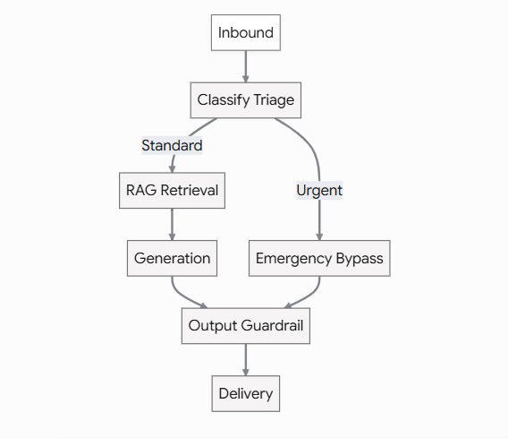
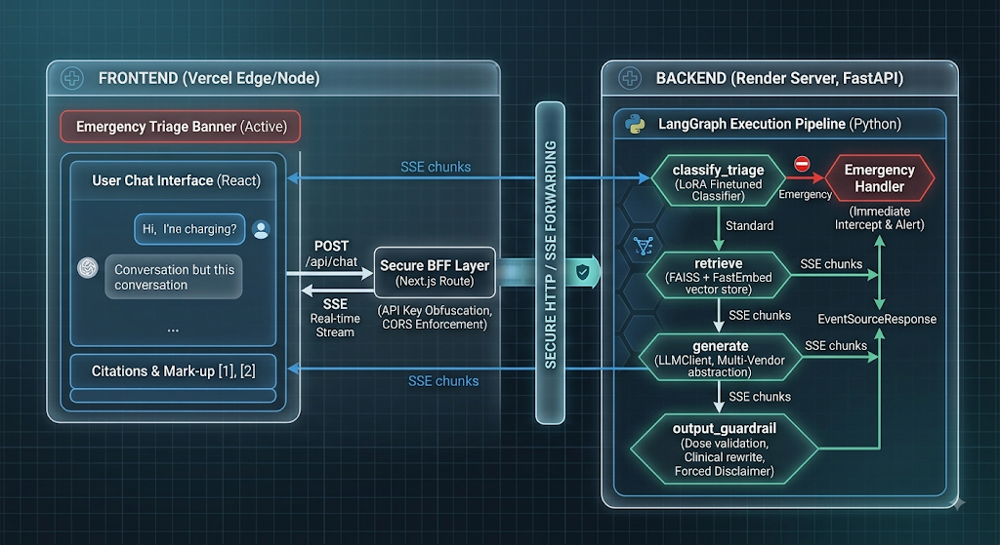

# MediSense AI

> 📖 **文档导航**：[README](README.md)（项目概览）· [功能说明](FEATURES.md)（技术细节）· [面试 QA](INTERVIEW_QA.md)

一个医疗信息问答机器人，用一个项目覆盖完整的应用型 AI 技术栈：RAG、用 LangGraph 编排的 LLM、一个 LoRA 微调的分类器（不只是 prompt）、单元测试、真实调用模型的评估、医疗安全护栏，以及前后端分离的部署。

先说免责声明，因为这个领域需要：**这是一个作品集项目，不是真正的临床工具。** 它不会给你诊断或药物剂量，每个回答末尾都会附一句指引你去找真正的医生或急救服务。

## 为什么用 LangGraph

做一个聊天循环最直接的方式，是把整个 agent 循环手写成一个函数，里面塞一堆 if。我想要的是请求流真正变成一个「图」，有一个有意义的条件分支：



当分诊分类器以足够的置信度判为「emergency」时，图会**完全跳过检索和生成**，直接返回一个固定的安全回复——LLM 根本看不到这条输入。这是 `app/graph.py` 里真正的分支，不是埋在 handler 深处三层 if 里的、评审时没人会注意到的逻辑。

## 架构



知识库是 MedlinePlus 的健康主题摘要，通过它的公开 webservices API 抓取（`app/ingestion.py`）。我特意不用常见的医疗 QA 数据集——很多数据集会因版权问题，把所有非美国政府来源的答案正文删掉。MedlinePlus 的内容是政府作品，属于公共领域，版权问题根本不存在。

## 微调部分，以及我遇到的一个 bug

`finetuning/train_lora.ipynb` 用 LoRA 把 `distilbert-base-uncased` 微调成一个 4 分类的症状紧急程度分类器——emergency / urgent / routine / self-care。数据集是模板合成的（没有我信得过的现成公开数据集），但训练集和测试集特意用**不相交的句式模板**，所以 held-out 准确率反映的是泛化到新表述的能力，而不是死记模板。

```bash
# 微调是 Jupyter notebook 工作流（finetuning/*.ipynb）：
#   prepare_dataset.ipynb → train_lora.ipynb → evaluate.ipynb
# 在带 CUDA torch 的环境（如 conda base-llm）里运行。train 约 10s（GPU），CPU 约 70-85s。
```

它在 held-out 集上达到 97.4%，看混淆矩阵，所有错误都落在「谨慎」的方向——没有一个真正的 emergency 被误判成 routine 或 self-care。考虑到这个分类器守的是什么门，这正是你希望错误偏的方向。

这里有个 bug，我觉得比准确率数字更有意思：训练过程中，我输入「I have a bad headache and I am sensitive to light, what could this be?」——典型的偏头痛——分类器却判成了 emergency。原因是我训练数据里，只有 emergency 标签下有这种描述的头痛（"sudden"、"severe"、"with confusion"），其他标签下根本没有同时出现 "headache" 和 "light sensitivity"，所以模型就学到了这个词组合等于最严重类别。我加了几个用同样措辞、但归到 routine 和 self-care 的样本，有效果——那条查询的 emergency 置信度从 0.97 降到 0.84——但在没有任何病史上下文的情况下，它仍然越过 emergency 阈值。我决定把「没有病史的头痛、系统必须猜时，宁可建议去检查」当作一个值得记录的限制，而不是继续追的 bug。同样的症状加上「每个月月经前都会这样」，它就能正确判成 routine。

## 安全

`/api/chat` 有 API key 认证 + 每 IP 速率限制。检索到的内容会先扫描 prompt 注入模式，并用「这是数据、不是指令」的显式标记包起来，然后才进入 LLM prompt。除此之外，针对医疗机器人的护栏：正则会捕获并改写确定性的诊断用语（"you have diabetes"）和具体药物剂量（"500mg every 6 hours"），而且免责声明会追加到**每一个**回答，不管模型说了什么，不只是看起来有风险的。结合紧急短路，真正危险的输入根本到不了生成这一步。CORS 锁定到部署的前端域名，后端的 API key 只存在于 Next.js 的 server route 里——永远不会进浏览器。聊天历史存 SQLite，仅为演示连续性，不涉及真实患者数据。

## 测试 vs 评估

`pytest`（53 个测试，全部离线，LLM 调用被 mock）检查的是代码：护栏正则行为、速率限制数学、ingestion 的 XML 解析、LangGraph 两条路由分支、认证。写这些测试实际上抓到了两个护栏正则的真实 bug——一个诊断模式的字符类没包含数字，导致漏掉 "type 2 diabetes"；另一个要求 "have" 和病名之间有填充词，导致 "you have diabetes for sure" 被放过了。

`evals/run_evals.py` 是另一回事——它检查整个系统，真实调用多厂商 LLM 和真实训练好的分类器，跑 11 个用例：回答是否真的用到了检索到的事实，是否避免泄露剂量或诊断，是否把胸痛、中风症状、自残语言路由到急救响应，藏在检索 chunk 里的 prompt 注入是否被捕获并忽略。目前 11/11 通过。

```bash
pytest                    # backend/，完全离线
python -m evals.run_evals # backend/，需要真实的 LLM key（LLM_MODEL_ID + 厂商 key）
```

## 本地运行

```bash
# 后端
cd backend
python3 -m venv .venv && source .venv/bin/activate   # Windows: .venv\Scripts\activate
pip install -r requirements.txt
cp .env.example .env   # 填 LLM_MODEL_ID + 厂商 key（如 DEEPSEEK_API_KEY）
pytest
uvicorn app.main:app --reload   # http://localhost:8000

# 前端，另开一个终端
cd frontend
npm install
cp .env.example .env.local   # MEDISENSE_BACKEND_URL + MEDISENSE_API_KEY（须与后端 APP_API_KEY 一致）
npm run dev                  # http://localhost:3000
```

## API

- `POST /api/chat` `{message, session_id?}` —— 跑 LangGraph 流水线，API key 认证 + 每 IP 限流
- `GET /api/chat/{session_id}/history`
- `GET /health` —— 存活检查
- `GET /health/ready` —— 就绪检查（分类器、向量库、LLM 配置）
- `GET /metrics` —— Prometheus 指标

## 部署

后端在 Render（Docker），前端在 Vercel。

1. 推送到 GitHub。
2. Render → New → Blueprint，连接仓库。根目录的 `render.yaml` 指向 `backend/`。在面板里设 `LLM_MODEL_ID` + 厂商 key（如 `DEEPSEEK_API_KEY`）、`APP_API_KEY`、`CORS_ORIGINS`。
3. Vercel → New Project，导入仓库，根目录设 `frontend`。设 `MEDISENSE_BACKEND_URL`（Render 的 URL）和 `MEDISENSE_API_KEY`（匹配 `APP_API_KEY`）。

有一点值得诚实说明：后端镜像带着 torch 和 transformers（给分诊分类器用），对 Render 免费层的 512MB 来说是一大块内存。真实负载下如果 OOM，升到付费 Starter 层是直接的解法。

## 技术栈

Python、FastAPI、LangChain、LangGraph、多厂商 LLM（通过 LLMClient 用 openai/anthropic SDK）、FAISS、fastembed、structlog、Prometheus、Hugging Face transformers + peft（LoRA 微调）、scikit-learn、pytest、Docker、Next.js 16、React 19、Tailwind v4、shadcn/ui，前后端分离（后端 Docker + render.yaml 可部署 Render，前端可部署 Vercel，配置已就绪）。

## 免责声明

MediSense AI 是演示项目，不是有执照的医疗设备。它不提供医疗建议，也不该用于真实的临床决策。如果你正经历医疗紧急情况，请拨打当地急救电话。
